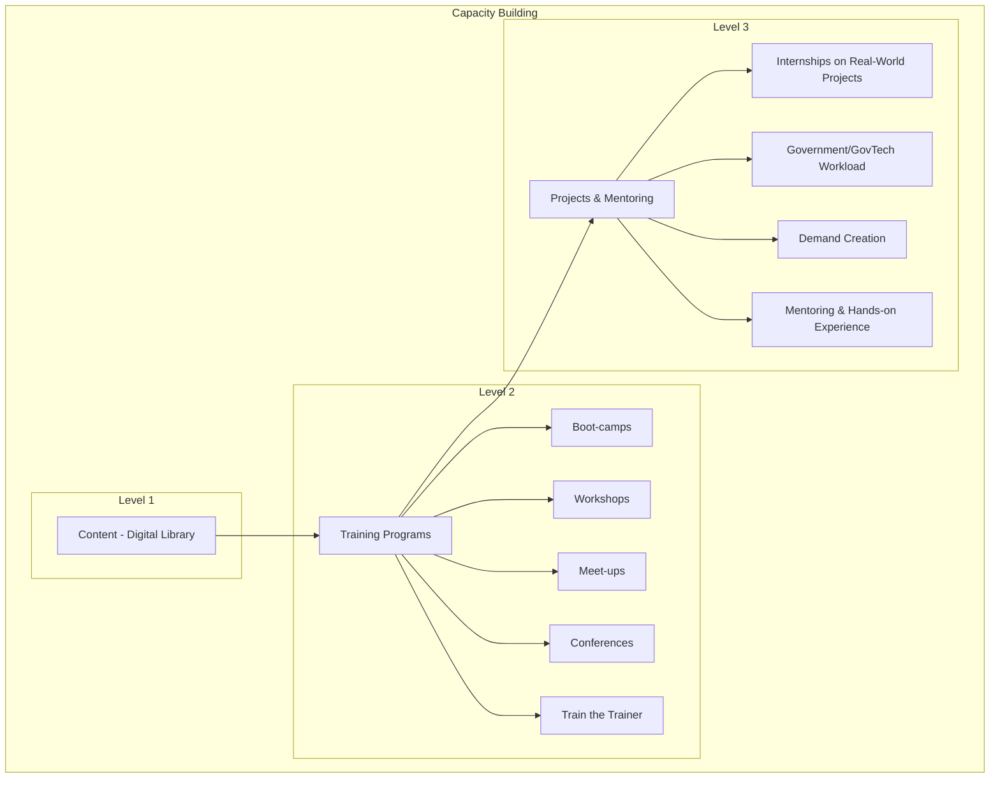

---
> Bridging the digital divide through collaboration and education, we pave the way for Sri Lanka's inclusive and innovative future.

> Harnessing the power of knowledge and collaboration, we drive Sri Lanka's digital evolution towards a more inclusive and innovative nation.

---
  
* TOC
{:toc}

## Introduction

Welcome to the **National Digital Capacity Library - Sri Lanka** (NDCL-SL), a centralized hub dedicated to enhancing digital literacy, fostering innovation, and empowering individuals and organizations across the nation. Our library serves as a comprehensive repository of digital resources, educational materials, and collaborative tools designed to bridge the digital divide and promote equitable access to information and technology.

## Purpose

The primary purpose of NDCL-SL is to build and strengthen the digital capacity of Sri Lanka by providing accessible, high-quality resources and fostering a community of continuous learning and innovation. We aim to support:

- **Education and Skill Development:** Offering a wide range of educational materials to enhance digital skills among students, educators, and professionals.
- **Innovation and Research:** Facilitating research and development by providing access to the latest tools, technologies, and information.
- **Community Engagement:** Creating a collaborative environment where individuals and organizations can share knowledge, ideas, and best practices.

## Vision

Our vision is to transform Sri Lanka into a digitally empowered society where every individual and organization has the knowledge, skills, and resources to thrive in the digital age. We envision a future where:

- **Digital Literacy is Universal:** Every citizen possesses the necessary digital skills to participate fully in the modern economy and society.
- **Innovation Flourishes:** A robust ecosystem supports continuous innovation, driving economic growth and social development.
- **Inclusive Access:** Digital resources and opportunities are accessible to all, regardless of geographic, economic, or social barriers.

## Mission

The mission of NDCL-SL is to:

- **Provide Comprehensive Resources:** Curate and maintain an extensive collection of digital resources, including e-books, tutorials, webinars, and research papers.
- **Promote Digital Literacy:** Develop and deliver training programs that enhance digital skills across various demographics and sectors.
- **Foster Collaboration:** Encourage collaboration among educators, professionals, researchers, and community members to drive collective progress.
- **Support Innovation:** Offer tools and platforms that enable the creation, testing, and implementation of innovative solutions to societal challenges.

## National Importance

In an increasingly digital world, the ability to access, understand, and utilize digital technologies is crucial for personal and national development. NDCL-SL addresses several key national priorities:

### 1. **Economic Growth**

By enhancing digital skills and fostering innovation, NDCL-SL contributes to the growth of the digital economy, creating new opportunities for businesses and entrepreneurs.

### 2. **Educational Advancement**

Supporting educators and students with high-quality digital resources improves the quality of education and prepares the workforce for future technological demands.

### 3. **Social Inclusion**

Ensuring equitable access to digital tools and information reduces the digital divide, promoting social inclusion and empowering marginalized communities.

### 4. **Government Efficiency**

Providing digital resources to public sector employees enhances the efficiency and effectiveness of government services, contributing to better governance and public administration.

## Problems We Aim to Solve

### 1. **Digital Divide**

There is a significant gap in digital access and skills between different regions and socioeconomic groups in Sri Lanka. NDCL-SL seeks to bridge this gap by providing accessible resources and training programs.

### 2. **Resource Scarcity**

Many educational institutions and organizations lack the necessary digital resources and tools to support effective teaching, learning, and innovation. Our library addresses this scarcity by offering a centralized repository of high-quality materials.

### 3. **Skill Gaps**

The rapid pace of technological advancement creates skill gaps in the workforce. NDCL-SL provides continuous learning opportunities to help individuals stay updated with the latest digital trends and technologies.

### 4. **Limited Collaboration**

There is a need for enhanced collaboration among educators, professionals, and researchers to drive innovation. NDCL-SL fosters a collaborative community to share knowledge and develop innovative solutions collectively.

## Our Solution

The **National Digital Capacity Library - Sri Lanka** offers a multifaceted solution to these challenges through:

### 1. **Comprehensive Digital Repository**

A vast collection of digital resources, including e-books, online courses, tutorials, research papers, and multimedia content, accessible to all members of the community.

### 2. **Training and Workshops**

Regularly scheduled training sessions, webinars, and workshops designed to enhance digital skills and knowledge across various domains and expertise levels.

### 3. **Collaborative Platforms**

Online forums, discussion boards, and collaborative tools that enable members to share ideas, seek assistance, and work together on projects and research initiatives.

### 4. **Innovative Tools and Technologies**

Access to the latest software, tools, and technologies that support innovation, research, and development in various fields, including software development, data science, cybersecurity, and more.

### 5. **Support Services**

Dedicated support teams to assist users in navigating the library’s resources, utilizing digital tools, and addressing any technical or content-related queries.

## Evolution of Capacity Building: From Content to Real-World Experience

### 1. Level 1: Content - Digital Library

At the foundation of the **National Digital Capacity Library - Sri Lanka** is the **Digital Library**, serving as the single source of truth and a one-stop-shop for all topics related to capacity building. This extensive repository includes a wide range of resources such as e-books, research papers, tutorials, multimedia content, and reference materials. By centralizing knowledge, the Digital Library provides a comprehensive frame of reference for individuals and organizations seeking to enhance their digital skills and understanding.

**Key Features:**
- **Comprehensive Resources:** Covers diverse subjects essential for digital capacity building.
- **Accessible Platform:** Easily searchable and user-friendly interface to facilitate seamless access to information.
- **Updated Content:** Regularly updated to reflect the latest trends, technologies, and best practices in the digital landscape.

### 2. Level 2: Training Programs

Building upon the foundational content, the next layer focuses on **Training Programs** designed to translate theoretical knowledge into practical skills. These programs include **Boot-camps**, **Workshops**, **Meet-ups**, **Conferences**, and **Train the Trainer** initiatives. By leveraging the resources from the Digital Library, training programs provide structured learning experiences that cater to various learning styles and professional needs.

**Components:**
- **Boot-camps:** Intensive, short-term training sessions that equip participants with specific skills in a condensed timeframe.
- **Workshops:** Interactive sessions that delve deeper into particular topics, allowing hands-on practice and collaborative learning.
- **Meet-ups:** Regular gatherings for community members to network, share experiences, and discuss emerging trends.
- **Conferences:** Larger events featuring keynote speakers, panel discussions, and presentations on cutting-edge developments in digital capacity.
- **Train the Trainer:** Specialized programs aimed at empowering individuals to become trainers themselves, thereby expanding the reach of capacity-building efforts.

### 3. Level 3: Projects & Mentoring

The final layer emphasizes **Projects & Mentoring**, where participants apply their acquired knowledge and skills to real-world scenarios. This experiential learning phase includes **Internships on Real-World Projects**, **Government/GovTech Workload**, **Demand Creation**, and **Mentoring & Hands-on Experience**. By engaging in practical projects, individuals gain invaluable hands-on experience, foster innovation, and contribute to meaningful initiatives that address national priorities.

**Elements:**
- **Internships on Real-World Projects:** Providing opportunities for participants to work on actual projects, bridging the gap between learning and practical application.
- **Government/GovTech Workload:** Collaborating with government agencies to support digital transformation initiatives and public sector projects.
- **Demand Creation:** Initiatives aimed at generating interest and demand for digital skills within various industries and communities.
- **Mentoring & Hands-on Experience:** Offering personalized guidance and support from experienced mentors to enhance learning outcomes and professional growth.

### Flow of Capacity Building

1. **Centralized Content Repository:** The Digital Library acts as the backbone, offering a vast array of resources that serve as the foundation for all capacity-building activities.
   
2. **Structured Training Programs:** Leveraging the comprehensive content, training programs provide structured and interactive learning experiences that cater to different needs and skill levels.
   
3. **Practical Application through Projects:** Participants apply their knowledge in real-world projects, gaining hands-on experience and contributing to impactful initiatives.
   
4. **Continuous Mentoring and Support:** Ongoing mentoring ensures that individuals receive the necessary guidance to navigate challenges, fostering continuous improvement and professional development.

---

## Personas We Address

NDCL-SL caters to a diverse range of personas, ensuring that our resources and services meet the needs of different segments of society:

### 1. **Students**

Providing educational materials and digital tools that support learning and skill development, preparing students for future careers in a digital economy.

### 2. **Educators and Trainers**

Offering comprehensive resources and training programs to enhance teaching methodologies and integrate digital tools into the classroom effectively.

### 3. **Professionals and Developers**

Supporting continuous professional development by providing access to advanced resources, tools, and collaborative platforms for innovation and research.

### 4. **Researchers and Academics**

Facilitating access to the latest research, publications, and collaborative opportunities to advance knowledge and drive scientific progress.

### 5. **Government and Public Sector Employees**

Enhancing the efficiency and effectiveness of public services through access to digital resources and training programs tailored to government needs.

### 6. **Entrepreneurs and Innovators**

Empowering entrepreneurs with the resources and support needed to develop and launch innovative digital solutions, contributing to economic growth and job creation.

### 7. **General Citizens**

Ensuring that all members of society have access to digital literacy resources, enabling them to participate fully in the digital world and benefit from its opportunities.

## National Importance and Impact

The **National Digital Capacity Library - Sri Lanka** plays a pivotal role in the nation's digital transformation by:

- **Enhancing Workforce Readiness:** Equipping the workforce with essential digital skills required in today's technology-driven job market.
- **Driving Economic Development:** Supporting the growth of the digital economy through innovation, entrepreneurship, and the development of new technologies.
- **Promoting Educational Excellence:** Improving the quality of education by integrating digital resources and tools into teaching and learning processes.
- **Fostering Social Equity:** Reducing disparities in digital access and skills, promoting inclusive growth and social cohesion.
- **Supporting Government Initiatives:** Enhancing the capabilities of public sector employees, leading to more efficient and effective governance.

## Summary

The **National Digital Capacity Library - Sri Lanka** is committed to building a digitally empowered society where knowledge, innovation, and collaboration drive national progress. By addressing critical challenges such as the digital divide, resource scarcity, and skill gaps, we provide comprehensive solutions that empower individuals and organizations to thrive in the digital age.

Join us in our mission to transform Sri Lanka through digital capacity building. Whether you are a student, educator, professional, researcher, or a passionate citizen, NDCL-SL offers the resources and support you need to succeed and contribute to our collective growth and success.

---

## Further Reading

- [National Digital Capacity Library - Sri Lanka Website](https://ictasl.github.io/capacity-building/)
- [Creative Commons Attribution 4.0 International License](https://creativecommons.org/licenses/by/4.0/)
- [GitHub Repository](https://github.com/ICTASL/capacity-building.git)
- [GitHub Discussions](https://github.com/ICTASL/capacity-building/discussions)
- [GitHub Issues](https://github.com/ICTASL/capacity-building/issues)
- [GitHub Pull Requests](https://github.com/ICTASL/capacity-building/pulls)

---

## GPT Prompts

1. **"What are the key challenges faced by digital libraries in developing countries, and how can they be addressed?"**
   - Explore the unique obstacles digital libraries encounter in developing regions and propose effective strategies to overcome them.

2. **"How does enhancing digital literacy contribute to national economic growth?"**
   - Analyze the relationship between digital literacy and economic development, highlighting specific mechanisms through which digital skills drive growth.

3. **"What are the best practices for fostering a collaborative community in a digital library environment?"**
   - Discuss methods and tools that can be used to build and sustain a collaborative and engaged community within a digital library.

4. **"How can digital libraries support innovation and research in emerging technologies?"**
   - Examine the role of digital libraries in providing resources and support for research and development in cutting-edge technological fields.

5. **"What impact does reducing the digital divide have on social inclusion and equity?"**
   - Investigate how efforts to bridge the digital divide can promote greater social inclusion and equity within a society.

6. **"How can government initiatives and digital libraries collaborate to enhance public sector efficiency?"**
   - Explore ways in which government programs and digital libraries can work together to improve the efficiency and effectiveness of public services.

7. **"What are the essential features of a successful digital capacity-building program?"**
   - Identify and elaborate on the key components that make a digital capacity-building initiative effective and sustainable.

---
