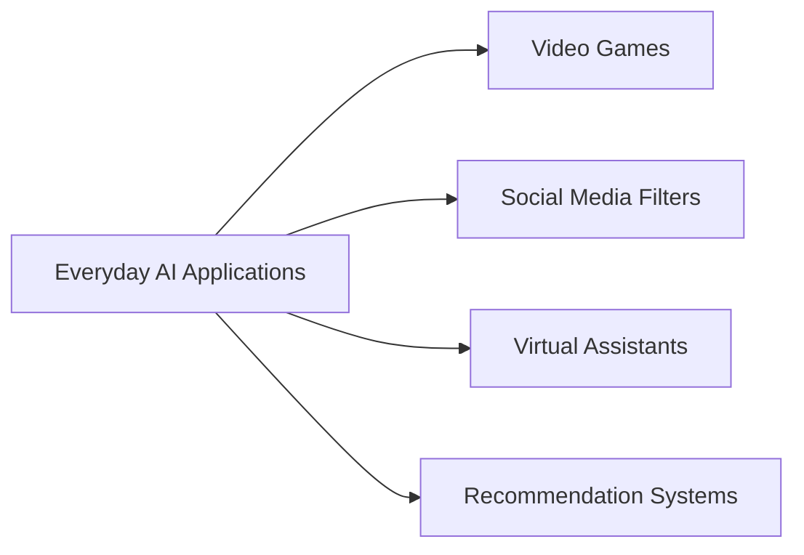
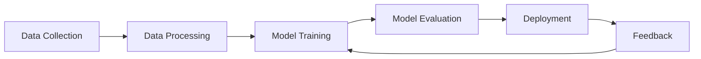
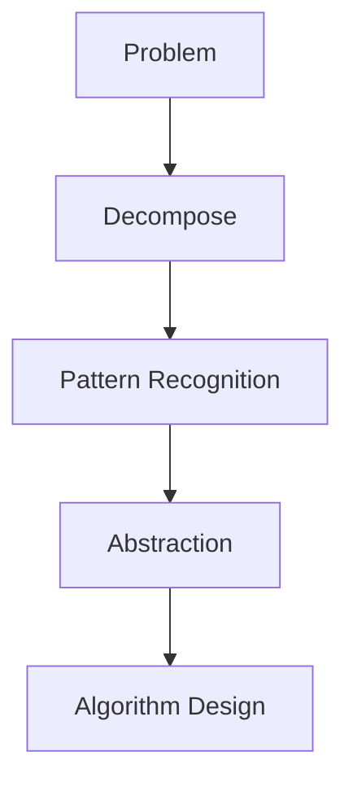

## Introduction

### AI is Everywhere!

Imagine playing your favorite video game, using social media filters, or asking your phone a question. These are all examples of **Artificial Intelligence (AI)** at work! AI helps make our everyday technology smarter and more interactive. From virtual assistants like Siri and Alexa to recommendation systems on streaming platforms, AI is all around us.

**Visual Aid: Everyday AI Applications**

### Why Should You Care About AI?

Understanding AI isn't just for tech experts—it's for everyone! Knowing about AI can help you excel in school, open up exciting career opportunities, and help you navigate a world increasingly shaped by intelligent machines. Whether you're interested in creating your own games, solving real-world problems, or simply staying informed, AI aptitude is a valuable skill to develop.

**Interactive Question:**  
*Can you think of a way AI helps you at home or school? Share your thoughts!*

### What Exactly is AI?

**Artificial Intelligence (AI)** refers to the ability of machines to perform tasks that typically require human intelligence. This includes things like learning, reasoning, problem-solving, and even creativity. Common misconceptions about AI include the idea that it's only about robots or that it can think exactly like humans. In reality, AI encompasses a wide range of technologies designed to assist and enhance human capabilities.

**What is AI Aptitude?**  
**AI aptitude** refers to the set of skills and knowledge that enable individuals to understand, interact with, and develop AI technologies effectively. It includes computational thinking, critical thinking, creativity, coding skills, data literacy, and ethical awareness.

## AI Skills for the Future

### Thinking Like a Machine (and a Human!)

#### Computational Thinking

**Computational Thinking** involves breaking down complex problems into smaller, manageable parts, recognizing patterns, and designing step-by-step solutions—much like how a computer processes information. This skill is crucial for programming, data analysis, and developing AI applications.

#### Critical Thinking

In an era where information is abundant, **Critical Thinking** helps you evaluate the credibility of sources, recognize biases in data and algorithms, and make informed decisions. It's about questioning assumptions and seeking evidence before accepting conclusions.

#### Creative Problem-Solving

AI can handle repetitive tasks, but **Creative Problem-Solving** is uniquely human. This skill allows you to use AI as a tool for innovation, whether it's designing a new app, creating art, or finding solutions to global challenges.

### Working with AI

#### The Basics of Coding

**Coding** is the foundation of AI. Learning basic programming concepts like variables, loops, and functions can help you create simple AI models and understand how more complex systems operate. Languages like Python are particularly popular in the AI community due to their simplicity and versatility.

#### Data: The Fuel of AI

AI systems learn from **Data**. Understanding how data is collected, processed, and analyzed is crucial. This includes recognizing the importance of data quality, privacy considerations, and the potential for bias in datasets.

**Visual Aid: Data Flow in AI**

#### Talking to AI

Effective communication with AI systems, often referred to as **Prompting**, involves giving clear and concise instructions. Whether you're asking a virtual assistant for the weather or using an AI chatbot for homework help, the way you phrase your questions can significantly impact the quality of the response.

## Developing Your AI Skills

### Learning About AI

#### Fun and Engaging Resources

There are numerous resources designed to make learning about AI enjoyable:

- **[Google AI Essentials](https://grow.google/ai-essentials/)** With Google AI Essentials, you’ll discover how you can use AI to assist, empower, and inspire you.
- **[Microsoft - Explore resources for understanding AI](https://www.microsoft.com/en-us/ai/ai-business-value-and-benefits#Resources)** Access extensive guidance and resources for informing a successful AI adoption and implementation journey.
- **[Amazon AWS - What Is Artificial Intelligence (AI)?](https://aws.amazon.com/what-is/artificial-intelligence/?sc_channel=el):** An introduction to Artificial Intelligence (AI).

#### AI in School

AI is increasingly integrated into education:

- **Personalized Learning:** AI-driven platforms adapt to your learning pace and style, providing customized resources and feedback.
- **Educational Tools:** Tools like intelligent tutoring systems help reinforce concepts and provide additional practice outside the classroom.

### Exploring AI

#### Hands-on Activities

Engaging in practical activities can solidify your understanding of AI:

- **Projects:** Create a simple chatbot using platforms like [Dialogflow](https://dialogflow.cloud.google.com/) or build a basic game that incorporates AI elements.
- **Experiments:** Use [Machine Learning for Kids](https://machinelearningforkids.co.uk/) to train AI models to recognize images, sounds, or text.

#### AI in Everyday Tech

Explore the AI features in the devices and apps you use daily:

- **Smartphones:** Experiment with virtual assistants, voice commands, and predictive text features.
- **Social Media:** Understand how AI powers recommendation algorithms and content moderation.

### Staying Curious

#### AI is Always Changing

AI technology evolves rapidly. Staying informed about the latest developments ensures you remain knowledgeable and adaptable:

- **News and Blogs:** Follow AI news through websites like [AI News](https://www.artificialintelligence-news.com/) and blogs from AI research institutions.
- **Podcasts and Videos:** Listen to AI-focused podcasts or watch educational YouTube channels like [CrashCourse](https://www.youtube.com/user/crashcourse) and [3Blue1Brown](https://www.youtube.com/channel/UCYO_jab_esuFRV4b17AJtAw).

#### Be a Responsible AI User

With great power comes great responsibility. Understanding the ethical implications of AI is crucial:

- **Ethical Considerations:** Learn about data privacy, algorithmic bias, and the societal impacts of AI.
- **Responsible Usage:** Use AI tools thoughtfully, ensuring they contribute positively to your life and the community.

## The Future with AI

### AI and Jobs

AI is transforming the job landscape, creating new opportunities and reshaping existing roles:

- **Emerging Careers:** Fields like AI ethics, machine learning engineering, and data science are growing rapidly.
- **Essential Skills:** In addition to technical skills, adaptability, creativity, and emotional intelligence are becoming increasingly valuable.

### AI and the World

AI has the potential to address some of the most pressing global challenges:

- **Healthcare:** AI assists in diagnosing diseases, developing personalized treatment plans, and managing healthcare records.
- **Environment:** AI helps monitor environmental changes, optimize energy usage, and develop sustainable solutions.
- **Space Exploration:** AI-powered robots and systems enable more efficient exploration of distant planets and celestial bodies.

### Your Role in the AI Future

You have the power to shape how AI develops and is used:

- **Active Participation:** Engage in AI projects, contribute to open-source communities, and stay informed about AI policies and ethics.
- **Innovation:** Use your unique perspective and creativity to develop new AI applications that can make a positive impact on society.

## Conclusion

AI aptitude is a vital skill in the 21st century, empowering you to navigate and influence a world increasingly driven by intelligent technologies. By developing your AI skills, embracing continuous learning, and acting responsibly, you can unlock endless opportunities for personal growth, creativity, and meaningful contributions to society.

### Real-World Examples and Success Stories

#### Success Stories
*(Imaginary cases)*
- **Meet Maya:** Maya, a 12-year-old, developed an AI chatbot to help her classmates with math homework. Her project not only improved her own understanding of AI but also aided her peers in learning.
- **High School AI Team:** A group of high school students used AI to create a sustainable energy solution for their community, showcasing the practical applications of AI in solving real-world problems.

#### Real-World Applications

- **Healthcare:** AI-powered systems like IBM Watson assist doctors in diagnosing diseases more accurately.
- **Entertainment:** Streaming services like Netflix use AI to recommend shows and movies based on your viewing history.
- **Environmental Conservation:** AI helps monitor wildlife populations and predict environmental changes to aid in conservation efforts.

#### Computational Thinking Diagram

#### Data Flow in AI

### Assessment Tools

#### Quiz Questions

**Quiz 1: Understanding AI Aptitude**

1. **What is AI Aptitude?**
   - A) The ability to use smartphones
   - B) The set of skills and knowledge to understand and work with AI
   - C) Playing video games
   - **Answer:** B) The set of skills and knowledge to understand and work with AI

2. **Why is computational thinking important?**
   - A) It helps in cooking
   - B) It helps in breaking down complex problems into manageable parts
   - C) It helps in drawing
   - **Answer:** B) It helps in breaking down complex problems into manageable parts

#### Self-Assessment Questions

- **What AI tool do you use the most, and how does it help you?**
- **Can you describe a problem you solved using computational thinking?**

### AI and Society

Explore how AI impacts society, including both benefits and challenges:

- **Job Transformation:** AI automates repetitive tasks, allowing humans to focus on more creative and strategic roles.
- **Privacy Concerns:** Discuss the importance of data privacy and how AI systems handle personal information.
- **Decision-Making:** AI assists in making informed decisions but raises questions about accountability and transparency.

### AI Ethics

Delve deeper into ethical considerations:

- **Fairness:** Ensuring AI systems do not perpetuate biases.
- **Accountability:** Understanding who is responsible for AI decisions.
- **Transparency:** Making AI processes understandable to users.

### Advanced Topics for Interested Learners

#### Machine Learning Basics

Introduce foundational concepts of machine learning:

- **Supervised Learning:** Training AI with labeled data.
- **Unsupervised Learning:** Finding patterns in unlabeled data.
- **Reinforcement Learning:** Teaching AI through rewards and penalties.

#### Future Trends in AI

Discuss emerging trends:

- **Augmented Reality (AR) and AI:** Enhancing real-world experiences with AI-driven insights.
- **Autonomous Vehicles:** How AI is revolutionizing transportation.
- **Personalized Medicine:** Tailoring healthcare treatments using AI.

### Encourage Community and Collaboration

#### Join AI Communities

- **Online Forums:** Participate in communities like [Reddit's r/MachineLearning](https://www.reddit.com/r/MachineLearning/) or [Stack Overflow](https://stackoverflow.com/questions/tagged/machine-learning).
- **Local Clubs:** Join or start an AI or coding club at your school.

#### Collaborative Projects

- **Group Projects:** Work with peers to develop AI-powered applications or solutions.
- **Hackathons:** Participate in AI-focused hackathons to challenge your skills and collaborate with others.

## Final Thoughts

Your guide effectively covers the essential aspects of AI aptitude, making it both informative and engaging for your target audience. By incorporating the suggested enhancements, you can create a resource that not only educates but also inspires learners to actively engage with AI technologies and develop their skills continuously.

**Key Takeaways:**

- **Comprehensive Coverage:** The guide addresses definitions, importance, relevance, skill development, and future implications.
- **Engagement:** Interactive elements, real-world examples, and hands-on activities keep learners engaged.
- **Resource-Rich:** Provides a diverse set of resources catering to different learning styles.
- **Ethical Focus:** Emphasizes responsible AI usage and ethical considerations, which is crucial in today's AI landscape.

**Next Steps:**

1. **Implement Suggested Enhancements:** Incorporate real-world examples, interactive questions, visual aids, and assessment tools.
2. **Review and Test:** Preview the article using a static site generator like Jekyll to ensure proper formatting and functionality.
3. **Gather Feedback:** Share the guide with a small group of students or educators to gather feedback and make necessary adjustments.
4. **Continuous Updates:** AI is a rapidly evolving field. Regularly update the guide to include the latest developments and resources.

By following these steps, your **AI Aptitude** guide will serve as a valuable and comprehensive resource that empowers learners to thrive in an AI-driven world.

*Happy Learning!*