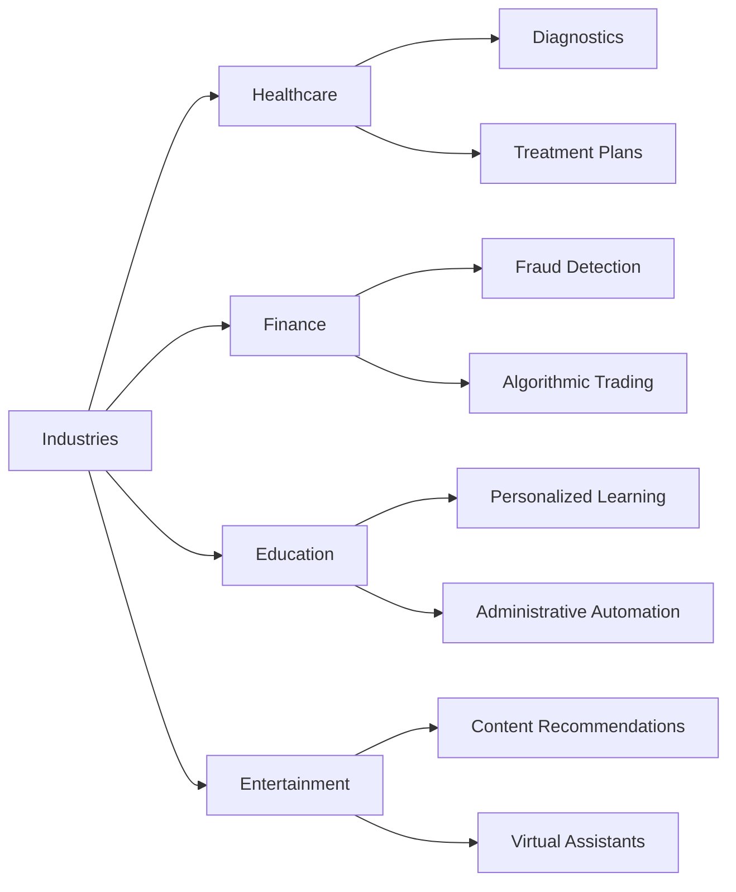

* TOC
{:toc}

## Introduction

### The AI Revolution

Artificial Intelligence (AI) is transforming the world at an unprecedented pace. From self-driving cars and virtual assistants to personalized recommendations on streaming platforms, AI's rapid advancements are reshaping various industries. Businesses are leveraging AI to optimize operations, enhance customer experiences, and drive innovation. As AI continues to evolve, its impact becomes more profound, influencing sectors such as healthcare, finance, education, and entertainment.

### The Human Element

While AI excels at processing vast amounts of data and performing complex calculations, the human element remains indispensable. Human skills such as critical thinking, creativity, ethical judgment, and effective communication are crucial in developing, deploying, and managing AI systems. These non-technical skills ensure that AI technologies are used responsibly, ethically, and effectively to address real-world problems.

### Thesis Statement

A successful career in AI requires more than just technical prowess. A combination of technical and non-technical skills, including critical thinking, collaboration, problem-solving, adaptability, continuous learning, leadership, communication, and domain knowledge, is essential for navigating the complexities of AI. These skills not only facilitate the ethical development and deployment of AI but also maximize the potential of AI solutions to drive meaningful impact.

## Core Technical Skills

Before delving into the non-technical aspects, it's important to acknowledge the foundational technical skills that underpin AI expertise.

### Programming

Proficiency in programming languages such as Python, R, or Julia is essential for developing AI models. These languages provide the tools and libraries necessary for data manipulation, algorithm implementation, and model training. Python, in particular, is widely used due to its simplicity and the extensive ecosystem of AI and machine learning libraries like TensorFlow, PyTorch, and scikit-learn.

### Machine Learning

Understanding machine learning algorithms and techniques is fundamental to AI. This includes supervised learning (where models are trained on labeled data), unsupervised learning (identifying patterns in unlabeled data), and reinforcement learning (training models through rewards and penalties). Mastery of these concepts enables the creation of models that can learn from data, make predictions, and improve over time.

### Mathematics and Statistics

A strong foundation in mathematics and statistics is crucial for AI. Key areas include probability, statistics, linear algebra, and calculus. These disciplines provide the theoretical underpinnings for understanding how AI algorithms work, how to evaluate model performance, and how to optimize models for better accuracy and efficiency.

### Data Visualization

The ability to communicate data insights effectively through visualizations is vital. Tools like Tableau, Power BI, and libraries like Matplotlib and Seaborn in Python help in creating meaningful charts and graphs. Data visualization aids in interpreting complex data, presenting findings to stakeholders, and making informed decisions based on data-driven insights.

### AI Fundamentals

A solid grasp of AI concepts, including neural networks, deep learning, and natural language processing (NLP), is essential. Neural networks mimic the human brain's structure to process data, deep learning involves training large neural networks with multiple layers, and NLP enables machines to understand and generate human language. These fundamentals are the building blocks for more advanced AI applications.

## Core Non-Technical Skills

While technical skills are indispensable, non-technical skills play a pivotal role in the successful application and management of AI technologies.

### A. Soft Skills

#### Critical Thinking

Critical thinking involves analyzing information, evaluating arguments, and making informed decisions. In the context of AI, it means assessing the validity of data, the reliability of models, and the implications of AI-driven decisions. Critical thinkers can identify potential biases in data, question the assumptions underlying AI algorithms, and ensure that AI applications are fair and unbiased.

#### Problem-Solving

AI projects often involve complex challenges that require innovative solutions. Effective problem-solving skills enable individuals to identify issues, brainstorm potential solutions, and implement strategies to overcome obstacles. This skill is crucial for developing AI models that address real-world problems and deliver tangible benefits.

#### Creativity

Creativity is essential for generating innovative ideas and developing novel AI applications. It involves thinking outside the box, experimenting with new approaches, and leveraging AI as a tool for creative expression. Creative problem-solving can lead to breakthroughs in AI, enabling the development of solutions that are both effective and original.

#### Adaptability

The AI landscape is constantly evolving, with new technologies, methodologies, and best practices emerging regularly. Adaptability allows individuals to embrace change, learn new skills, and stay current with the latest advancements in AI. This flexibility is vital for maintaining relevance and effectiveness in a rapidly changing field.

#### Continuous Learning

AI is a dynamic and rapidly advancing field, making continuous learning a necessity. Staying up-to-date with the latest research, tools, and trends ensures that individuals can leverage cutting-edge technologies and methodologies. Engaging in lifelong learning fosters personal growth and professional development, enabling individuals to keep pace with AI's evolution.

#### Leadership

Leadership skills are important for guiding AI projects, inspiring teams, and driving organizational change. Effective leaders can articulate a vision, motivate team members, and coordinate efforts to achieve common goals. Leadership also involves making strategic decisions, managing resources, and fostering a collaborative and inclusive environment.

#### Communication

Effective communication is essential for conveying complex AI concepts to both technical and non-technical audiences. It involves explaining the functionality and implications of AI systems, presenting data-driven insights, and facilitating collaboration among diverse teams. Strong communication skills ensure that AI projects align with organizational objectives and stakeholder expectations.

#### Teamwork

Collaboration is key to successful AI projects, which often involve multidisciplinary teams comprising data scientists, engineers, domain experts, and business stakeholders. Teamwork skills enable individuals to work effectively with others, share knowledge, and contribute to collective problem-solving efforts. Collaborative environments foster innovation and enhance the quality of AI solutions.

#### Time Management

Managing time efficiently is crucial for meeting project deadlines, prioritizing tasks, and balancing multiple responsibilities. Effective time management ensures that AI projects progress smoothly, resources are utilized optimally, and goals are achieved within the stipulated timeframe.

#### Decision-Making

AI projects often involve making decisions under uncertainty, where the outcomes are not always predictable. Strong decision-making skills enable individuals to evaluate options, assess risks, and choose the most appropriate course of action. This skill is vital for steering AI projects toward successful completion and mitigating potential challenges.

#### Language Skills Including Articulation

Proficiency in language and the ability to articulate ideas clearly are essential for effective AI interaction. Strong language skills enable you to:

* **Document AI Projects:** Clearly record the process, methodologies, and outcomes of AI projects.
* **Write Comprehensive Reports:** Produce well-structured and informative reports that communicate findings to diverse audiences.
* **Deliver Engaging Presentations:** Present complex AI concepts in a clear and compelling manner.

**The Role of Articulation in AI Prompting**

Articulation skills, or the ability to express ideas clearly and effectively, are crucial in AI prompting for several reasons:

1. **Precision and Clarity:**
   * Well-articulated prompts ensure that the AI accurately understands the desired output.
   * Clear and concise prompts minimize misunderstandings and lead to more relevant responses.

2. **Enhanced Communication:**
   * Effective communication helps convey complex ideas and instructions to the AI, resulting in more accurate and relevant outputs.

3. **Contextual Understanding:**
   * Providing context through well-articulated prompts enables the AI to generate more meaningful and tailored responses.

4. **Improved Results:**
   * Precise language can lead to more accurate and useful results, saving time and effort in refining prompts.

5. **Minimizing Misinterpretations:**
   * Clear and specific prompts reduce the likelihood of the AI misinterpreting the request.

6. **Effective Feedback:**
   * Articulation skills are essential for providing clear and constructive feedback to the AI, helping to improve its performance.

By honing your articulation skills, you can maximize the potential of AI tools and achieve better outcomes in your work.

#### Human-in-the-Loop Skills and Ability to Augment and Collaborate with AI Agents

Human-in-the-loop (HITL) refers to the integration of human judgment and oversight in AI systems. HITL skills involve understanding how to effectively collaborate with AI agents, providing necessary inputs, and interpreting AI outputs. This ensures that AI systems are aligned with human values, ethical standards, and organizational goals.

The ability to augment and collaborate with AI agents is a crucial skill in today's technology-driven world. This involves understanding the strengths and limitations of AI and leveraging its capabilities to enhance human productivity and decision-making. Effective collaboration with AI agents requires clear communication, critical thinking, and adaptability, allowing humans to guide and refine AI outputs while also integrating AI-generated insights into their workflows. By mastering this skill, individuals can unlock the full potential of AI, leading to more innovative and efficient solutions across various domains. 

### B. Domain Expertise

#### Business Acumen

Understanding the business implications of AI is crucial for identifying opportunities where AI can drive value. Business acumen involves recognizing how AI can optimize operations, enhance customer experiences, and create competitive advantages. It also includes the ability to assess the financial and strategic impact of AI initiatives.

#### AI Ethics and Governance

Navigating the ethical considerations of AI development and deployment is essential for ensuring responsible AI usage. This involves understanding issues such as data privacy, algorithmic bias, transparency, and accountability. AI ethics and governance frameworks guide the development of fair, unbiased, and trustworthy AI systems.

#### AI in Business Applications

Applying AI to solve real-world business problems requires domain-specific knowledge. This involves understanding the unique challenges and opportunities within a particular industry and leveraging AI technologies to address them. AI in business applications can lead to improved efficiency, enhanced decision-making, and innovative product offerings.

#### Collaboration with Technical Teams

Effective collaboration with data scientists, engineers, and other technical experts is essential for the successful implementation of AI projects. This involves clear communication, mutual understanding of goals, and the ability to integrate technical solutions with business objectives.

#### Project Management

Planning, executing, and monitoring AI projects require strong project management skills. This includes defining project scope, setting milestones, allocating resources, managing budgets, and ensuring timely delivery. Effective project management ensures that AI initiatives are completed successfully and deliver the intended outcomes.

#### Project Management for AI Initiatives

AI projects present unique challenges, such as dealing with large datasets, managing model training, and ensuring ethical compliance. Specialized project management skills for AI initiatives involve understanding these challenges and applying appropriate methodologies to address them. This ensures that AI projects are managed effectively and deliver high-quality results.

#### Analytical Reasoning

Analytical reasoning involves the ability to analyze complex problems, break them down into smaller components, and develop logical solutions. This skill is crucial for interpreting data, evaluating AI models, and making informed decisions based on evidence and analysis.

## Developing and Cultivating Non-Technical Skills

Cultivating non-technical skills is a continuous process that involves intentional effort and dedication. Here are strategies to develop and enhance these essential skills.

### Lifelong Learning

The importance of continuous learning and skill development cannot be overstated in the rapidly evolving field of AI. Embrace a mindset of curiosity and openness to new knowledge. Engage in ongoing education through courses, workshops, and self-study to keep your skills current and relevant.

### Mentorship and Coaching

Seeking guidance from experienced professionals can accelerate your learning and provide valuable insights. Mentors can offer advice, share their experiences, and help you navigate the complexities of AI projects. Coaching relationships foster personal and professional growth, enabling you to develop both technical and non-technical skills effectively.

### Practical Experience

Gaining hands-on experience through projects and internships is crucial for applying theoretical knowledge in real-world scenarios. Practical experience allows you to develop problem-solving skills, collaborate with diverse teams, and understand the nuances of AI development and deployment. Engaging in projects, whether personal or professional, enhances your ability to tackle complex challenges and innovate effectively.

### Professional Development

Attending conferences, workshops, and webinars provides opportunities to learn from experts, stay updated with the latest trends, and network with professionals in the field. Professional development activities foster continuous learning, expose you to new ideas, and help you build connections that can support your career growth.

## Leveraging Recommendations from Leading Institutions

### Harvard Business Review (HBR)
1. **[The AI Skills You Should Be Building Now](https://hbr.org/podcast/2024/09/the-ai-skills-you-should-be-building-now)**: This article discusses the importance of "fusion skills," which include intelligent interrogation, judgment integration, and reciprocal apprenticing. These skills help employees effectively work with AI tools.
2. **[The Skills Your Employees Need to Work Effectively with AI](https://hbr.org/2023/11/the-skills-your-employees-need-to-work-effectively-with-ai)**: Focuses on the need for effective interpersonal skills and domain knowledge to integrate AI into the workforce.
3. **[Reskilling in the Age of AI](https://hbr.org/2023/09/reskilling-in-the-age-of-ai)**: Highlights five paradigm shifts in reskilling, emphasizing that reskilling is a strategic imperative and a responsibility of every leader.

### Massachusetts Institute of Technology (MIT)
1. **[No Code AI and Machine Learning: Building Data Science Solutions](https://professional.mit.edu/course-catalog/no-code-ai-and-machine-learning-building-data-science-solutions)**: This program teaches how to leverage AI and data science without coding, emphasizing the importance of understanding AI applications and making data-driven decisions.
2. **[AI for Executives Academy](https://executive.mit.edu/course/ai-executive-academy/a04U1000001TzPJIA0.html)**: A comprehensive program that covers both technical and business aspects of AI, providing hands-on workshops to innovate and problem-solve with AI.

### World Economic Forum (WEF)
1. **[Skills in the Age of AI](https://www.weforum.org/podcasts/agenda-dialogues/episodes/skills-in-the-age-of-ai/)**: Discusses how AI is disrupting core skills and the importance of lifelong learning and reskilling to prepare for the future economy.
2. **[3 Things We Learned About AI and Skilling from Experts](https://www.weforum.org/stories/2024/12/things-learned-ai-skilling-workers-technology/)**: Offers insights from experts on how AI is changing job roles and the need for continuous skill development.

## The Power of Non-Technical Skills in AI

Non-technical skills are the glue that holds AI projects together, ensuring that technical solutions are aligned with human values and organizational goals. Here are some real-world examples illustrating the impact of these skills.

### Example 1: Successful AI Project

**Scenario:** A healthcare provider implements an AI system to predict patient readmissions.

**Key Non-Technical Skills Utilized:**
- **Communication:** Clear articulation of project goals and AI system functionalities to all stakeholders.
- **Collaboration:** Effective teamwork between data scientists, healthcare professionals, and IT staff.
- **Problem-Solving:** Addressing challenges related to data quality and integration with existing systems.
- **Creative Thinking:** Developing innovative approaches to enhance the AI model's accuracy.
- **Human-in-the-Loop:** Continuous oversight and input from healthcare professionals to refine the AI predictions.

**Outcome:** The AI system successfully reduces patient readmissions by providing accurate predictions, enhancing patient care, and optimizing hospital resources.

### Example 2: Failed AI Project

**Scenario:** A retail company deploys an AI-driven customer service chatbot.

**Key Non-Technical Skills Lacking:**
- **Ethical Considerations:** Ignoring potential biases in the chatbot's responses.
- **Teamwork:** Poor collaboration between the technical team and customer service representatives.
- **Problem-Solving:** Inadequate handling of complex customer queries leading to frustration.
- **Human Oversight:** Lack of human-in-the-loop oversight resulted in the chatbot providing incorrect information.

**Outcome:** The chatbot failed to meet customer expectations, leading to negative feedback, decreased customer satisfaction, and a damaged company reputation.

### Example 3: Innovative AI Solution

**Scenario:** An environmental organization uses AI to monitor wildlife populations.

**Key Non-Technical Skills Utilized:**
- **Creative Thinking:** Designing AI models to identify and track various wildlife species.
- **Problem-Solving:** Overcoming challenges related to data collection in remote areas.
- **Effective Collaboration:** Working with local communities, researchers, and technologists to gather data.
- **Human-AI Synergy:** Combining AI's data processing capabilities with human expertise to interpret results and implement conservation strategies.

**Outcome:** The AI-driven monitoring system provides accurate and timely data, aiding in wildlife conservation efforts and informing policy decisions.

## Conclusion

### The Future of AI

AI aptitude is not just about mastering algorithms and technical tools; it's about integrating essential non-technical skills to create AI solutions that are ethical, effective, and impactful. As AI continues to advance, the synergy between technical and non-technical skills will determine the success and sustainability of AI initiatives across various domains.

### A Call to Action

To thrive in the AI era, individuals must commit to developing their non-technical skills alongside their technical expertise. This includes enhancing language and articulation, fostering teamwork, honing problem-solving and creative thinking abilities, and embracing human-in-the-loop practices. By cultivating these skills, you can navigate the complexities of AI, contribute to its responsible development, and maximize the potential of AI solutions.

### Final Thoughts

In summary, the integration of non-technical skills is essential for anyone aspiring to succeed in the AI landscape. These skills ensure that AI technologies are developed and deployed in ways that align with human values, ethical standards, and societal needs. By prioritizing both technical and non-technical skills, you can unlock the full potential of AI and contribute to a future where technology serves humanity effectively and responsibly.

*Happy Learning!*
