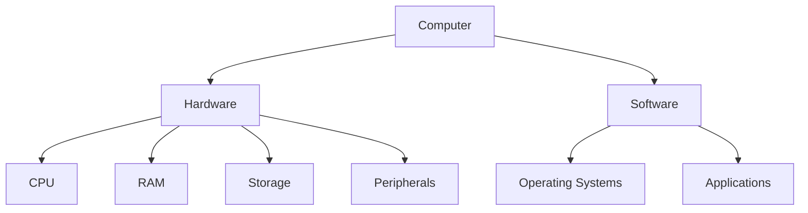
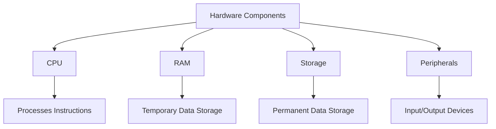

Develop essential computer skills to navigate the digital world confidently. This section covers the basics of computers, typing proficiency, and utilizing educational software effectively.

* TOC
{:toc}

## Introduction to Computers

Understanding the fundamental concepts of computers is the first step towards becoming proficient in using them. This section introduces what computers are, the different types available, and their basic components.

### What is a Computer?

A **computer** is an electronic device that processes data according to a set of instructions called software. It can perform a wide range of tasks, from simple calculations to complex simulations.

- **Definition and Purpose**
  - Computers are designed to store, retrieve, and process data.
  - They aid in performing tasks efficiently, reducing human error, and handling large amounts of information quickly.

- **Everyday Uses of Computers**
  - **Communication:** Email, video conferencing, and social media.
  - **Education:** Research, online courses, and educational software.
  - **Entertainment:** Streaming videos, gaming, and digital art.
  - **Productivity:** Word processing, spreadsheets, and project management.

### Types of Computers

Computers come in various forms, each suited to different tasks and environments.

- **Desktops**
  - Typically used in homes and offices.
  - Offer high performance and are easily upgradable.
  
- **Laptops**
  - Portable and suitable for on-the-go use.
  - Include built-in components like keyboards and screens.

- **Tablets**
  - Touchscreen devices ideal for media consumption and light productivity tasks.
  - Often used in educational settings for interactive learning.

- **Smartphones**
  - Highly portable and multifunctional.
  - Serve as communication devices and provide access to numerous applications.

### Basic Components of a Computer

Understanding the hardware and software components of a computer is crucial for effective usage.

- **Hardware vs. Software**

  - **Hardware:** The physical parts of a computer (e.g., monitor, keyboard, CPU).
  - **Software:** The programs and applications that run on the computer (e.g., operating systems, word processors).

- **Key Hardware Components**

  - **CPU (Central Processing Unit):** The brain of the computer that performs calculations and executes instructions.
  - **RAM (Random Access Memory):** Temporary storage that allows the computer to access data quickly.
  - **Storage:** Devices like HDDs (Hard Disk Drives) or SSDs (Solid State Drives) that store data permanently.
  - **Peripherals:** External devices such as keyboards, mice, printers, and monitors that connect to the computer.

- **Essential Software**
  - **Operating Systems:** Software that manages hardware resources and provides services for computer programs (e.g., Windows, macOS, Linux).
  - **Applications:** Programs designed for specific tasks (e.g., Microsoft Word for word processing, Adobe Photoshop for image editing).

### GPT Prompts
(New to prompting? Read our [Guide to Prompting for Learning](../../../ai-aptitude/guide-to-prompting-for-learning/) ) 

- *"What is a computer and how does it work?"*
- *"Describe the different types of computers and their uses."*
- *"List and explain the basic hardware components of a computer."*

## Basic Typing

Typing is a fundamental skill that enhances productivity and communication. This section covers the importance of typing, proper hand placement, touch typing techniques, and practice exercises.

### Importance of Typing Skills

- **Enhancing Productivity**
  - Faster typing speeds allow for more efficient completion of tasks.
  - Reduces the time spent on writing documents and emails.

- **Facilitating Communication**
  - Effective typing skills improve the clarity and speed of written communication.
  - Essential for online interactions, such as messaging and social media.

### Proper Hand Placement and Posture

Maintaining correct hand placement and posture is crucial for typing efficiency and preventing strain.

- **Finger Positioning on the Keyboard**
  - Place fingers on the **home row** keys:
    - Left hand: A, S, D, F
    - Right hand: J, K, L, ;
  - Thumbs should rest on the **spacebar**.

- **Ergonomic Sitting Posture**
  - Sit upright with feet flat on the floor.
  - Keep wrists straight and elbows at a 90-degree angle.
  - Position the monitor at eye level to avoid neck strain.

### Introduction to Touch Typing

Touch typing is the ability to type without looking at the keyboard, increasing speed and accuracy.

- **Learning to Type Without Looking**
  - Practice keeping your eyes on the screen while typing.
  - Memorize the keyboard layout through repetitive drills.

- **Benefits of Touch Typing**
  - Increases typing speed and reduces errors.
  - Enhances focus and efficiency in completing tasks.

### Typing Practice Exercises

Consistent practice is key to improving typing skills. Utilize online resources and structured drills to build proficiency.

- **Online Typing Tutorials**
  - Websites like [TypingClub](https://www.typingclub.com/) and [Keybr](https://www.keybr.com/) offer interactive lessons.
  
- **Practice Drills to Improve Speed and Accuracy**
  - Start with short exercises focusing on individual keys.
  - Gradually increase the complexity and length of typing tasks.
  - Monitor progress and set achievable goals.

### GPT Prompts
(New to prompting? Read our [Guide to Prompting for Learning](../../../ai-aptitude/guide-to-prompting-for-learning/) ) 

- *"How can I improve my typing speed and accuracy?"*
- *"Provide some typing practice exercises for beginners."*
- *"Explain the correct hand placement for touch typing."*

## File Management

### Overview of File Systems

A **file system** is a way to organize and store your files on a computer. Think of it like a big library where everything has its place. 

- **Understanding Folders and Directories**
  - **Folders:** These are like folders in a binder. They help you keep related files together. For example, you might have a folder for school projects and another for photos.
  - **Directories:** This term is often used interchangeably with folders. Directories help you navigate and manage your files on the computer.

- **Creating, Renaming, Moving, and Deleting Files and Folders**
  - **Creating:** You can create new files and folders to start organizing your information. For example, you might create a new folder named "Science Projects."
  - **Renaming:** If you want to change the name of a file or folder, you can rename it to something more descriptive, like changing "Doc1" to "Math_Homework."
  - **Moving:** You can move files and folders to different places on your computer. This helps keep things organized. For example, moving a completed project from the "In Progress" folder to the "Completed" folder.
  - **Deleting:** If you no longer need a file or folder, you can delete it to free up space. Just make sure you don't delete something important by mistake!

### Organizing Files Effectively

Keeping your files organized makes it easier to find what you need when you need it.

- **Best Practices for Maintaining a Tidy File System**
  - **Consistent Organization:** Keep similar files together. For example, all your homework assignments can be in one folder, and your pictures in another.
  - **Regular Cleanup:** Take time to go through your files regularly and remove any that you no longer need. This helps keep your computer running smoothly.

- **Using Descriptive Names and Consistent Naming Conventions**
  - **Descriptive Names:** Give your files and folders clear names that describe their content. Instead of "File1," name it "History_Essay_June."
  - **Consistent Naming:** Use the same format for naming your files and folders. For example, always start with the date or the subject, followed by the topic. This makes it easier to sort and find your files later.

### Backing Up Important Data

Backing up your data means making copies of your important files so you don’t lose them if something goes wrong with your computer.

- **Importance of Regular Backups**
  - **Protection Against Data Loss:** If your computer crashes or gets damaged, backups ensure you still have your important files.
  - **Peace of Mind:** Knowing that your work is safe makes using the computer less stressful.

- **Introduction to Cloud Storage Solutions and External Drives**
  - **Cloud Storage:** Services like Google Drive, Dropbox, and OneDrive let you save your files online. This means you can access them from any device with an internet connection.
  - **External Drives:** These are physical devices like USB flash drives or external hard drives. You can copy your files onto these drives and keep them in a safe place.

### GPT Prompts:
(New to prompting? Read our [Guide to Prompting for Learning](../../../ai-aptitude/guide-to-prompting-for-learning/) ) 

- *"How do I organize my files and folders effectively?"*
- *"What are the best practices for naming my documents?"*
- *"Explain how to back up important files using cloud storage."*

## Basic Troubleshooting

### Common Computer Issues

Sometimes, computers can have problems that make them hard to use. Knowing how to fix these issues can save you time and frustration.

- **Slow Performance:** Your computer might feel sluggish and take longer to open programs or files.
- **Frozen Applications:** Sometimes, a program stops responding and doesn't do anything when you try to use it.
- **Connectivity Problems:** You might have trouble connecting to the internet or other networks.

### Simple Solutions

Many common computer problems can be fixed with easy steps.

- **Restarting the Computer:** Turning your computer off and on again can fix many issues. It clears temporary problems and gives the computer a fresh start.
- **Closing Unresponsive Programs:** If a program freezes, you can force it to close. On Windows, press `Ctrl + Alt + Delete` and choose the program to close. On Mac, press `Cmd + Option + Esc` to force quit.
- **Checking Internet Connections:** If you're having trouble with the internet, make sure all cables are plugged in correctly. You can also try restarting your router or modem.

### When to Seek Help

Sometimes, problems are too big to fix on your own. Knowing when to ask for help is important.

- **Identifying Problems That Require Professional Assistance**
  - **Persistent Issues:** If your computer keeps crashing or running slowly even after trying to fix it.
  - **Advanced Software Problems:** Issues like system errors that you can't resolve with simple troubleshooting.
  - **Security Concerns:** If you think your computer has a virus or malware, it's best to get help from a professional.

### GPT Prompts:

- *"What should I do if my computer is running slow?"*
- *"How can I fix a frozen application?"*
- *"When should I contact tech support for my computer issues?"*

## Introduction to Word Processing

### Basic Features of Word Processors

Word processors are programs that help you create and edit text documents. They have many features to make writing easier and more organized.

- **Creating, Saving, and Formatting Documents**
  - **Creating:** Start a new document by opening your word processor and selecting "New Document."
  - **Saving:** Save your work regularly by clicking the save button or pressing `Ctrl + S` (Windows) or `Cmd + S` (Mac).
  - **Formatting:** Change the look of your text by adjusting the font, size, color, and adding headings or bullet points.

### Essential Tools

Word processors have tools that help you write better and faster.

- **Spell Check:** Automatically checks your spelling and highlights any mistakes. You can usually find this tool in the toolbar.
- **Grammar Check:** Helps correct grammar errors and improve sentence structure.
- **Formatting Options:** Let you style your text to make it easier to read. You can add bold, italics, underlines, and more.

### Creating Simple Documents

Word processors are used to create various types of documents for different purposes.

- **Writing Essays:** Organize your thoughts into paragraphs with a clear beginning, middle, and end.
- **Letters:** Compose personal or professional messages using the letter format.
- **Reports:** Compile information and data into structured documents with headings and sections.

### GPT Prompts:

- *"How do I create and format a document in Microsoft Word?"*
- *"What are some tips for writing a report using a word processor?"*
- *"Explain the use of spell check and grammar check tools."*

## Basic Internet Navigation

### Using Web Browsers

Web browsers are programs that let you access and view websites on the internet.

- **Understanding Browser Features and Settings**
  - **Tabs and Windows:** Open multiple websites at the same time using tabs. You can also open new windows for different tasks.
  - **Bookmarks:** Save your favorite websites so you can visit them easily later.
  - **Extensions/Add-ons:** Small programs that add extra features to your browser, like blocking ads or saving passwords.
  - **Settings:** Customize your browser's preferences, such as your homepage, privacy settings, and appearance.

### Effective Search Techniques

Knowing how to search effectively helps you find the information you need quickly.

- **Using Search Engines Effectively to Find Reliable Information**
  - **Keywords:** Use specific words related to what you're looking for. For example, instead of searching "birds," search "how do sparrows build nests."
  - **Boolean Operators:** Use words like AND, OR, and NOT to narrow down or expand your search results.
  - **Quotation Marks:** Put phrases in quotes to search for the exact words in that order, like "climate change effects."
  - **Filters:** Use filters to sort results by date, type of content, or region to get more accurate information.

### Evaluating Online Sources

Not all information on the internet is true. It's important to check if a website is reliable.

- **Identifying Credible Websites and Avoiding Misinformation**
  - **Authority:** Look for information from trusted sources like educational institutions, government websites, or reputable organizations.
  - **Accuracy:** Check if the information is correct by comparing it with other reliable sources.
  - **Purpose:** Understand why the information is there. Is it to inform, sell something, or entertain?
  - **Design and Usability:** Professional and well-maintained websites are more likely to provide trustworthy information.

### GPT Prompts:

- *"How do I use different features in a web browser?"*
- *"What are some effective search strategies for finding information online?"*
- *"How can I determine if a website is credible and trustworthy?"*

## Digital Citizenship

### Responsible Online Behavior

Being a good digital citizen means using the internet responsibly and respectfully.

- **Understanding Digital Etiquette and Respectful Communication**
  - **Politeness:** Use kind words and be respectful when communicating online.
  - **Respecting Others:** Listen to different opinions and avoid bullying or harassment.
  - **Constructive Feedback:** Offer helpful and positive comments instead of negative ones.

### Privacy and Security

Protecting your personal information is important to stay safe online.

- **Protecting Personal Information and Maintaining Online Privacy**
  - **Limit Sharing:** Be careful about how much personal information you share on social media and other websites.
  - **Privacy Settings:** Adjust your account settings to control who can see your information.
  - **Secure Connections:** Use secure networks, like your home Wi-Fi, especially when sharing sensitive information.

### Understanding Copyright and Fair Use

Respecting others' work is an important part of using the internet.

- **Respecting Intellectual Property Rights**
  - **Copyright Laws:** These laws protect creators' work, such as books, music, and videos, so others can't use them without permission.
  - **Fair Use:** This allows limited use of copyrighted material without permission for things like education, commentary, or news.
  - **Attribution:** Always give credit to the original creators when using their work.

### GPT Prompts:

- *"What is digital citizenship and why is it important?"*
- *"How can I protect my personal information online?"*
- *"Explain the concepts of copyright and fair use in the digital world."*

## Introduction to Spreadsheets

### Basic Spreadsheet Operations

Spreadsheets help you organize and manage data efficiently.

- **Creating, Saving, and Navigating Spreadsheets**
  - **Creating:** Open your spreadsheet program and start a new sheet to enter your data.
  - **Saving:** Regularly save your work to avoid losing any information.
  - **Navigating:** Use tabs to move between different sheets and cells to enter or view data.

### Entering and Formatting Data

Properly entering and formatting data makes your spreadsheets easy to read and use.

- **Inputting Data, Using Formulas, and Formatting Cells**
  - **Inputting Data:** Click on a cell and type in your information, like numbers or text.
  - **Using Formulas:** Perform calculations by typing formulas, such as `=SUM(A1:A5)` to add numbers in cells A1 to A5.
  - **Formatting Cells:** Change how your data looks by adjusting fonts, colors, borders, and cell sizes.

### Simple Data Analysis

Analyzing data helps you understand and present information clearly.

- **Creating Charts and Graphs to Visualize Data**
  - **Charts:** Use bar charts, pie charts, or line charts to display data visually.
  - **Graphs:** Plot data points to show trends and patterns.
  - **Pivot Tables:** Summarize large amounts of data to find important information easily.

### GPT Prompts:

- *"How do I create a basic spreadsheet in Excel?"*
- *"What are some essential formulas for beginners?"*
- *"How can I visualize data using charts and graphs?"*

## Using Educational Software

Educational software enhances learning by providing interactive and engaging tools. This section explores what educational software is, popular options for primary students, installation guides, and tips for effective usage.

### Overview of Educational Software

- **Definition and Benefits**
  - Educational software refers to applications designed to support learning and teaching.
  - Benefits include interactive learning, personalized education, and the ability to track progress.

- **Types of Educational Software**
  - **Interactive Games:** Make learning fun and engaging through gamified experiences.
  - **Learning Apps:** Focus on specific subjects or skills, such as math or reading.
  - **Tutorials:** Provide step-by-step guidance on various topics.

### Popular Educational Software for Primary Students

- **Khan Academy Kids**
  - Provides free educational resources tailored for children.
  - Includes interactive lessons, videos, and practice exercises.

- **Scratch Jr.**
  - Introduces basic coding concepts to young children.
  - Allows students to create their own interactive stories and games through simple programming blocks.

### How to Install and Use Educational Software

- **Step-by-Step Installation Guides**
  
  - **Khan Academy Kids:**
    1. Go to the [Khan Academy Kids page](https://learn.khanacademy.org/khan-academy-kids/).
    2. Download the app from your device's app store.
    3. Follow the on-screen instructions to set up an account.
  
  - **Scratch Jr.:**
    1. Navigate to the [Scratch Jr. website](https://www.scratchjr.org/).
    2. Download the app from the app store suitable for your device.
    3. Open the app and start creating projects.

- **Navigating and Utilizing Features Effectively**
  - Familiarize yourself with the software's interface and available tools.
  - Explore different activities and lessons to understand how they support learning objectives.
  - Encourage experimentation and creativity through open-ended tasks.

### Tips for Effective Use of Educational Software

- **Setting Learning Goals**
  - Define clear objectives for what you want to achieve with the software.
  - Track progress and adjust goals as needed to ensure continuous improvement.

- **Balancing Screen Time**
  - Ensure that students have a healthy balance between digital learning and other activities.
  - Encourage breaks and physical movement to prevent fatigue.

- **Encouraging Interactive and Hands-On Learning**
  - Promote active engagement with the software through interactive tasks and projects.
  - Provide guidance and support to help students navigate challenges and explore new concepts.

### GPT Prompts

- *"What are some popular educational software tools for primary students?"*
- *"How do I install and set up [specific educational software] on my computer?"*
- *"Provide tips for using educational software effectively in learning."*

## Additional Resources

Enhance your learning experience with these additional resources, including online tutorials, helpful websites, and interactive activities.

### Recommended Online Tutorials and Courses

- **TypingClub**
  - [TypingClub](https://www.typingclub.com/) offers free typing lessons that are engaging and easy to follow.
  
- **Khan Academy**
  - [Khan Academy](https://www.khanacademy.org/) provides a wide range of free courses covering various subjects.
  
- **Code.org**
  - [Code.org](https://code.org/) introduces students to basic coding concepts through fun and interactive lessons.

### Helpful Websites and Tools

- **PBS Kids**
  - [PBS Kids](https://pbskids.org/) offers educational games and videos for young learners.
  
- **National Geographic Kids**
  - [National Geographic Kids](https://kids.nationalgeographic.com/) provides articles, videos, and activities about animals, science, and the world.
  
- **Funbrain**
  - [Funbrain](https://www.funbrain.com/) combines learning and fun through games, books, and comics.

### Interactive Activities

- **Create a Digital Story**
  - Use Scratch Jr. to create your own interactive story or game.
  
- **Typing Challenge**
  - Set a goal to increase your typing speed by practicing with online typing tests.
  
- **Educational Game Night**
  - Organize a game night using educational software to make learning social and enjoyable.

### GPT Prompts

- *"Suggest some online tutorials for learning basic computer skills."*
- *"What are the best websites for practicing basic typing?"*
- *"Provide ideas for projects to apply basic computer skills."*

---

*Feel free to explore each section and use the GPT prompts to deepen your understanding and enhance your learning experience!*

